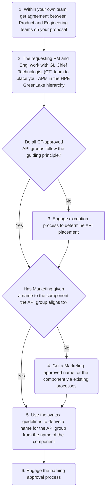
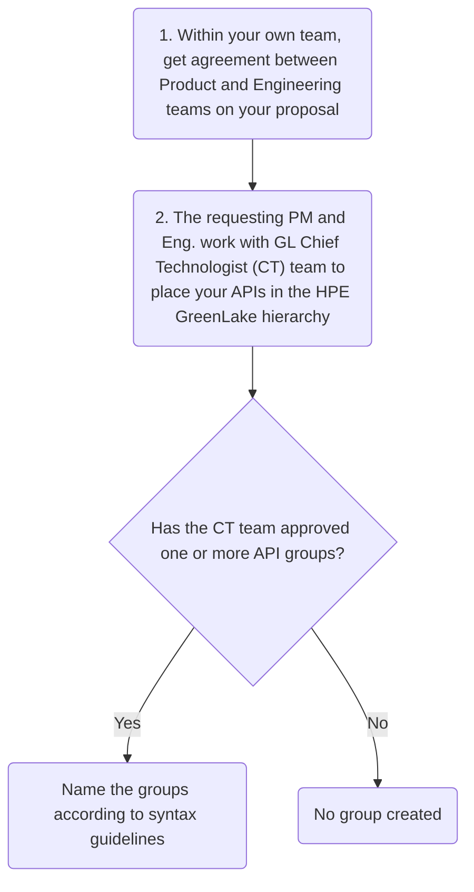

# Adding a New API Group

The HPE GreenLake (GL) team governs the growth of HPE GreenLake APIs with an approach that considers both structure and naming to make it easy for a developer to find the right API for their needs and to support HPE brand strategy. **This process is about more than just approving the API group name(s).** The approval process begins with a review of the boundaries represented by the proposed API group(s), which helps determine the appropriate naming strategy.

To add an API group to the [HPE GreenLake registry](https://developer.greenlake.hpe.com/docs/greenlake/standards/ratified/api/api-groups/api-grp-registry/), you must follow the standards and process here. For resource collections and other levels below an API group, you do not need to follow them.

This process gives you the right to create an API group, but does not guarantee publication of these APIs on the HPE GreenLake Developer Portal. The APIs you create in this group must comply with all applicable [standards](https://developer.greenlake.hpe.com/docs/greenlake/standards/) to be published.

## Guiding principle

We strive to create API groups that align to customers' and partners' mental model of HPE GreenLake, making it easy for them to find the right API for their needs. We do this by aligning an API group with a high-level, externally visible component and naming it after that component.

Your proposed API group should align with one of the following:

| API group exposure | Type of component | Examples |
| --               | --                | --       |
|External group|*Service on the platform*. Functionality running on top of the platform with a tile or link to it from the platform or from the service page.|- The `block-storage` API group aligns to the Block Storage service within Data Services service  - The `compute-ops-mgmt` API group aligns with the Compute Ops Management service|
|External group|*Core platform capability*. Functionality that is part of the platform, with a UI accessible from the platform's pages.|- The `devices` API group aligns to Device Management functionality on the platform  - The `identity` API group aligns to identity management functionality on the platform including Users, API Clients, and Identity Providers|
|Internal group|*HPE Internal-facing operation*. API operations that are never intended to be publicly documented and which we want to discourage customers from using should they discover them. See below for examples. Internal groups must start with "internal-".|- The `internal-gts-compliance` API group aligns to functionality for Global Trade Services compliance  - The `internal-orders` API group aligns to order management functionality for both licenses and devices|

## Internal API groups

### Process executive summary

The approval process for creating an internal API group is more streamlined than for an external group: essentially an architectural review to confirm that your APIs deserve a group, with no governance on naming. But if someday you determine that your internal API group should be exposed externally, you must take it through the full approval process for an external API group, and change all code to reference that new external group prior to publishing the documentation externally.

### When to use internal API groups

**Important:**

If you are creating an API that *is being considered to be opened up to external use in the future*, you MUST create it within an external API group, but you MUST NOT make the documentation publicly visible until the API is released to the public. This avoids the future pain of changing production code dependent on your API.

Internal API groups are for APIs that are never intended to be used by customers. Although they MUST be documented for internal use, the documentation MUST NOT be publicly released.

Internal API group names must start with `internal-` prefix to ensure clarity of their purpose and to help:

* Discourage customers from using the API if they discover their existence
* Ensure that tools being created and released to customers only utilize external APIs (such as scripts, a CLI, powershell, terraform)

The following are example reasons why an API MAY be considered for an internal group. APIs that meet these criteria MAY still be in external API groups, but MUST be documented appropriately and have the documentation released only to the correct target audience.

* APIs that are not standards compliant MUST NOT be published publicly
* APIs that operate the platform itself (and don't expose a public facing platform feature). These would be APIs that are only used by developers, operators, and potentially support personnel.
* APIs that support a feature that is planned to be deprecated within 6 - 9 months
* Unreleased APIs for which there are active plans to release a newer version of the API within 6 - 9 months
* UI-only APIs that facilitate a UX workflow where multiple API calls and transactions must be managed across multiple different service boundaries [see service types here](https://developer.greenlake.hpe.com/docs/greenlake/standards/policies/api/)

## Process overview - external API groups

## Process overview - internal API groups

## Step 0: Get an approved name for your aligned component

We're calling this step '0' because it isn't part of creating an API group. It's something that should be done early in the product development process, and that if not done early could slow down this process for adding an API group. Simply, the name of an API group is derived from the name of the component it aligns to, so if that component does not yet have an approved name from the Brand team then there is no source for the API group name. Getting such a name for an HPE GreenLake service offering can sometimes take weeks or months, so **product managers**, we recommend that you work with your product marketing contact to do this early. If you wait until you've started *this* process, then your developers might be blocked from coding because you're doing it at the last minute (Step 4).

## Step 1: Aligning within your team

We know you have digested our [guiding principle](#guiding-principle) (thanks!) and believe that your idea for an API group is the right idea.

However, a BU team must first be aligned within itself before it can successfully align with the HPE GreenLake platform team to build a cohesive API ecosystem. So before you propose an API group to us, make sure that your Product Management and Engineering teams agree on that proposal.

## Step 2: Determining which API group(s) to create

Before we can consider any names you've suggested, we have to make sure that you're creating the right groups, that the boundary lines for the API groups you proposed follow the [guiding principle](#guiding-principle) as best they can and fit well into the existing API hierarchy.

Send an email to the PDL [HPE GreenLake API Standards](mailto:hpegl-api-standards@hpe.com) to start this step of the process, describing the group of APIs you want to create and what it aligns to. **Your request must come from representatives of both Product Management and Engineering** to ensure that you’ve completed Step 1. If your proposal is for an [internal API group](#internal-api-groups), state that. Otherwise by default we'll assume that you're proposing an external API group.

The platform Chief Technologist team will help determine the appropriate boundaries for your set(s) of APIs and how they fit under existing structures. To best follow the [guiding principle](#guiding-principle), the CT team might recommend:

* Shrinking or expanding your API groups to better align with an existing component
* Splitting your APIs into multiple groups that each align with existing components
* Treating your APIs as a resource collection under another API group rather than their own API group
* Structuring your APIs to align with a future product structure to avoid releasing something that would soon become mismatched with visual boundaries

The output of this step is a definition of the API groups to create, which could number from zero to many. The platform CT team owns this decision. If they cannot come to a decision that follows the guiding principle, the proposal goes to the exception process in Step 3.

If your proposal was for an internal API group, the process ends here. Using the [syntax guidelines](#syntax-guidelines), you can give your group any name not yet [in use](https://developer.greenlake.hpe.com/docs/greenlake/standards/api/api-grp-registry/). Just make sure the [HPE GreenLake API Standards](mailto:hpegl-api-standards@hpe.com) team knows this name so that they can update the registry.

## Step 3: Exception process for API placement

If Step 2 cannot produce a proposal that follows the guiding principle, book a meeting with the following parties:

* Platform CT team: [Michael Zayats](mailto:michael.zayats@hpe.com)
* Chief Product Officer team: [Vincent Ng](mailto:vng@hpe.com)
* HPE GreenLake Marketing team: [Paul Zinn](mailto:paul.zinn@hpe.com)
* If the API group comes from another BU, representatives from BU Chief Technologist, Product Management, Engineering, and Marketing teams

This group will discuss architecture, use cases, go to market, and other factors relevant to the proposal, balancing them to decide which API groups to create, if any.

## Step 4: Get an approved name for your aligned component

(external API groups only)

Step 2 (or, rarely, Step 3) determined which high-level, externally visible HPE GreenLake component your API group aligns to. The API group will be named for that component, so if the component itself has not yet been given a name approved by the Brand team, you have nothing from which to derive a name for the API group. Work with your product marketing manager to get an approved name for the component. They can help you come up with candidate names and will guide the approval process.

Yes, this is the same as Step 0. If you do it then, before thinking about API groups, you don't have to do it here.

## Step 5: Derive a proposed name for the API group

Your API group name will be derived from the name of the component it aligns to. Use the syntax guidelines below to come up with one or more candidate names to propose.

**The API group name must be used consistently across all coding/command environments and tools**—for example, no shortening it for a CLI—so that users can count on that name as they move between environments.

### Syntax guidelines

* **Keep it short**: 20 characters maximum
  * This length allows easier repeated typing when used in CLI commands.
  * If the source name includes **HPE GreenLake for** or **HPE GreenLake with**, omit that from the API group name.
  * Abbreviate **management** to **mgmt**, do not omit it.\
    e.g. **Storage Fabric Management** becomes **storage-fabric-mgmt**
  * Where the source name uses an acronym, use that acronym in the API group name.
  * Abbreviate words whenever you can save multiple characters but keep the word recognizable. Don't abbreviate to save one or two characters.\
    e.g. **operations** becomes **ops**
* **Keep it code friendly**
  * Use all lower case even if the source name is capitalized.
  * Use hyphens (**-**) instead of spaces.
  * Avoid the use of **and**, **&**.
* For internal API groups, your name will be prepended with **internal-**.

## Step 6: Get an approved name for the API group

(external API groups only)

Send an email to the PDL [HPE GreenLake API Standards](mailto:hpegl-api-standards@hpe.com)
to start this step of the process by describing API Groups and what they align from the [guiding principle](#guiding-principle). Include your candidate name(s) and all supporting information.

The HPE GreenLake Marketing team, represented on the PDL, will ask any necessary clarifying questions and then meet with the Brand team to get an approved name. You should expect a response from Brand within a week.

## Keeping up with product changes

Over time, an API group’s name can get out of sync with the component that the group is aligned to, whether from product structure changing, the market name for a service or capability changing, or potentially some other cause. A minor change to a component name, such as from HPE Sustainability Insight Center to HPE Sustainability Insight Hub, does not cause a problem relative to its API group name because the core words haven’t changed and a user would still easily be able to associate the component with the API group.

But when the core words change in a component name, the conflict with its API group name causes confusion. We can’t let this remain as a permanent state, so when such a situation occurs:

* The primary (documented) name of the API group will change to match the new name of the component it aligns to, but we will continue to support the old name for backward compatibility for some period of time.
* Global Marketing will work with the platform CT team and the business team that owns the API group to agree on the timing of both the addition of the new name and the decommissioning of the old one. These decisions should take into account:
  * The cost to HPE of making the changes and maintaining two names.
  * The impact to customers and partners who already use the API group under the old name. Customers might demand that an old name remain compatible for multiple years.
  * The impact of the name change to our branding.
