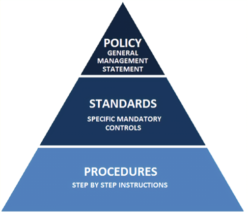

# Vulnerability Management and Patching Standard

## Introduction

This document provides technical vulnerability management requirements which supports the Secure Posture policy, security software patch management, and vulnerability remediation. This security standard is intended to minimize the security exposure of HPE. Limited exceptions to this standard may occur due to technology limitations.

This document is a **standard** within the document hierarchy.

Policy—Statements, rules, or assertions that specify the correct or expected behavior of an entity.

Standard—A rule, condition, or requirement describing the following information for products, systems, services, or practices: (i) classification of components; (ii) specification of materials, performance, or operations; or (iii) delineation of procedures.

Procedure—A process or procedure that describes how to perform an explicit operation or explicit reaction to a given event.

## Assets within scope

HPE GreenLake product teams MUST comply with this standard. Assets in scope are those for which HPE GreenLake is responsible for managing and scheduling updates:

* Cloud services that HPE consumes
* Firmware
* Platform as a service (PaaS)
* Software
* Software as a service (SaaS)
* Software components or libraries
* Software products

HPE Services Team services are out of scope for this standard.

## Security requirements

Vulnerabilities can be identified through people, processes, and technology. For example, security vulnerabilities can be identified through architecture threat analysis (ATA), penetration testing, or cloud security scanning solutions. HPE adheres to the following cybersecurity principles:

* Secure by design—Systems, solutions, microservices, APIs (application programming interfaces), or features MUST be designed and implemented to be secure. Security vulnerabilities MUST be remediated or granted a risk extension treatment (see [Risk extension treatment](#risk-extension-treatment)) prior to implementation.

* Secure in operations—While assets are in operation, development teams MUST monitor vulnerabilities and configuration drift by establishing secure baselines. Findings MUST be remediated according to the remediation schedules listed below.

* The remediation schedules specified in this document may be updated. Refer to the latest ratified version of this document for the correct schedules.

## Risk extension treatment

Vulnerabilities contribute to risk. If a vulnerability cannot be patched or fixed within the required timeline described in [Vulnerability remediation schedules](#vulnerability-remediation-schedules), a risk extension MUST be approved by the vice president of the business unit to continue offering the service or before putting a new service into production. This would be the responsibility of the asset custodian or owner who best understands the business impact to be the risk extension approver. The corresponding business unit representative can be a requestor. Risk extensions can be granted for a duration up to 90 days. Renewals follow the same process.

All requirements in this standard MUST be met and reported to senior leadership.

Risk extension requests can be submitted [here](https://hpe.sharepoint.com/teams/riskregister/SitePages/ITHelpdeskHome.aspx).

You will be notified 30 days before your risk extension expires.
Prior to expiration, please provide proof the risk has been mitigated or a request for additional risk extension.

## Vulnerability severity levels

HPE has established the following severity levels to assist in triage. Severity ratings, such as CVSS, are subject to a re-evaluation process based on environment and business impact. In the event of conflicts, the highest severity level applicable shall apply.

<table>
<colgroup>
<col style="width: 23%" />
<col style="width: 76%" />
</colgroup>
<thead>
<tr class="header">
<th>Vulnerability severity</th>
<th>Sources/characteristics</th>
</tr>
</thead>
<tbody>
<tr>
<td>Critical </td>
<td>Architecture threat analysis, pentest, vulnerability scanner, Product Security Response Team (PSRT), security code review, or product team assesses the vulnerability to be critical or the complete CVSS score, including base, temporal, and environmental components, to be &gt;= 9.0 in the product context.  
OR PSRT determines that a vulnerability is critical based on threat feeds that indicate that an active exploit is imminent.  
OR immediate threat, media attention, or customer concern that transcend the use and meaning of the CVSS score.  </td>
</tr>
<tr>
<td>High  </td>
<td>Architecture threat analysis, pentest, vulnerability scanner, security code review, or PSRT assesses the vulnerability to be high.  
OR someone is known to be exploiting the vulnerability  
OR product teams assess the complete CVSS score, including base, temporal, and environmental components, to be &gt;= 7.0 in the product context.  
OR the vulnerability has received media attention generating customer concern. </td>
<tr>
<td>Medium </td>
<td>Architecture threat analysis, pentest, security code review, or vulnerability scanner has determined that the vulnerability will not cause damage.  
AND no one is known to be exploiting the vulnerability.  
AND product teams assess the complete CVSS score, including base, temporal, and environmental components, to be &gt;= 4.0 in the product context.  
AND the vulnerability has not received media attention generating customer concern. </td>
</tr>
<tr>
<td>Low </td>
<td>Architecture threat analysis, pentest, security code review, or vulnerability scanner has determined that the vulnerability will not cause damage.  
AND No one is known to be exploiting the vulnerability.  
AND product teams assess the complete CVSS score, including base, temporal, and environmental components, to be &lt; 4.0 in the product context.  
AND the vulnerability has not received media attention generating customer concern. </td>
</tr>
</tbody>
</table>

All CVEs must be eradicated. Even if there is zero present exposure, the existence of a CVE must not be tolerated.

## Vulnerability remediation schedules

HPE has established the following remediation timelines which is independent of sprints and product improvement planning.

| Tool severity | Production remediation standard/schedule | Non-production remediation standard/schedule |
|---------------|------------------------------------------|----------------------------------------------|
| Critical      | 30 days                                  | 60 days                                      |
| High          | 30 days                                  | 60 days                                      |
| Medium        | 90 days                                  | 180 days                                     |
| Low           | 180 days                                 | 360 days                                     |

Days indicates calendar days

Nothing herein prevents a business unit or service team from adopting more stringent schedules than required above.

Remediation is accomplished when a patch is available for customer download (for software or firmware) and when the fix is in production (for service).

## Business specific addenda

Nothing within this document shall invalidate or change prior business unit specific addenda previously issued.

**Original publication date (yyyy-mm-dd):** 2024-04-02
