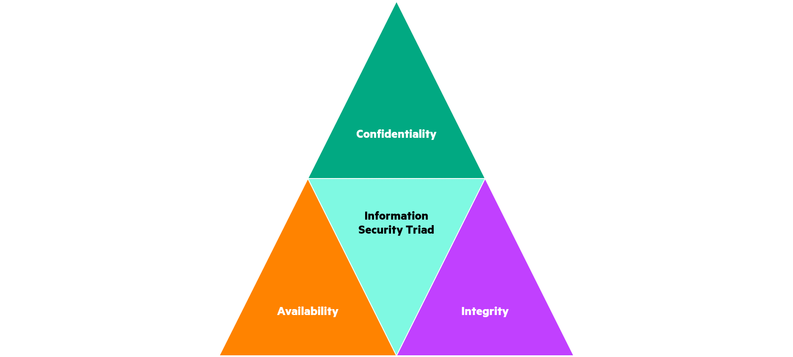

---
seo:
  title: Secure Architecture Design | HPE GreenLake Cloud Platform
toc:
  enable: true
  maxDepth: 2
---

# Secure Architecture Design

## Introduction/Overview

The purpose of this document is to provide architects and development teams with the guiding principles and best practices for building secure by design architectures. These best practices are derived from HPE Policy, industry standards and frameworks, regulations and laws. Refer to [Policy for Secure Architecture Design](../../policies/secure_design_and_architecture_policy.md) for the accompanying policy to this standard.

The focus of secure design is to build a system architected on secure design principles to increase the likelihood of achieving the standard security objectives of confidentiality, integrity, and availability using the standard mechanisms of authentication, authorization, and audit, as well as other special considerations such as layered defense and defense in depth. Securely designed architectures are more fault tolerant and resilient to coding defects, limiting the risk of vulnerabilities that may be introduced by developers whose focus is most often on functionality versus security. Confidentiality, Integrity and Availability are sometimes referred to as the "Information Security Triad" or the "CIA Triad".

Shifting security further left in the development lifecycle significantly reduces the total cost of ownership. Secure by design architectures have fewer defects in operation than those which are only tested after deployment. Defects found in the design phase have a significantly reduced cost compared to finding and fixing them after deployment.

>Statistics show that while 50% of security issues are code-related defects, the remaining 50% are design-level problems, which can’t be found effectively by code reviews or penetration testing alone. Architecture analysis can help you detect flaws early in the SDLC [Secure Development Lifecycle] by analyzing underlying design principles, architecture, security controls, and processes used to implement the application.

(source: [Synopsis.com](https://www.synopsys.com/blogs/software-security/security-risks-that-architecture-analysis-can-resolve/))

## Protecting Confidentiality

Confidentiality refers to the protection of sensitive information from disclosure. Disclosure can be accidental or a result of malicious activity. In the design phase, the types of information to be consumed, processed and stored by the architecture and their corresponding sensitivity must be considered, when determining the appropriate security measures to plan for implementation. The rigor of these measures depends on the impact that a loss of confidentiality will have to the system and the business. Requirements for the protection of information include:

### Encryption at Rest and in Transit

- Data with the highest confidentiality must be encrypted when at rest and only authorized users can decrypt
  - Examples of high confidentiality data include but are not limited to, Personal Data or Personally Identifiable Information (PII), Intellectual Property (IP), Personal Health Information (PHI), Trade Secrets, Secret Keys and Credentials, Payment Card and Financial Data, etc.
- Data must be encrypted in transit, and only authorized users can decrypt
  - A minimum of TLS 1.2 is required, by default without down select
    - TLS 1.3 is recommended
    - See [GreenLake Cryptographic Requirements](GLS_Crypto_Requirements.md) for most current requirements
- Key Management
  - Implement cipher suites and algorithms commensurate with data protection requirements
  - Separate Encryption Keys from the data they protect
  - Restrict key access to authorized individuals and processes
  - Distribute keys in a secure manner
  - Automate key rotation
  - Audit the history of each key, including creation, usage and deletion

### Least Privilege

Designing with least privilege helps minimize the impact if an attacker gets access to the product/service when it is configured at the lowest privileges compared to running the same product/service with an elevated privilege like root. Achieving the principle of least privilege can be accomplished by granting the user, process, or service the minimum privilege to complete its function. The practices below must be considered when planning the architecture.

- Least privilege implemented to permit only intended functionality
- Permissions must be set to only allow explicitly authorized readers (see also RBAC, least privilege and Authorization)
- Use Read-only context (as appropriate)
- Configurable Role-Based Access Control with defined use cases
  - Default roles created by an application must be configured with the minimal privilege required to perform their intended operation.
  - File and directory permissions configured with least privilege, granting access only to authorized users and processes
  - Processes and daemons should run at a minimum privilege, unless an explicit need for root is identified.
- Minimize root access wherever possible. Use of root must be via elevation of privilege from designated users, and be auditable.

### Personal Data or PII

If your service processes or stores Personal Data, sometimes referred to as Personally Identifiable Information or PII, the architecture should use methods to either:

- Implement Pseudonymization
  - Pseudonymization is a method that replaces or removes information in data sets that can identify individuals
  - Use pseudonymization when the ability to track data back to its origin is needed
  - Techniques include use of a counter, message authentication code (MAC), random number generator (RNG), Encryption, Cryptographic Hash function
- Implement Anonymization
  - Anonymization removes or encrypts identifiers that connect an individual to stored data, rendering it permanently unidentifiable/unrecognizable
  - Use anonymization when tracking the data to the individual is not required
  - Techniques include scrambling, personalized anonymization (whereby a user is given the option to choose the method), masking, blurring
- Implement Tokenization
  - Tokenization replaces sensitive data, such as credit card numbers, is replaced by unique alphanumeric strings called tokens
  - Use tokenization when regulatory compliance requires it (e.g. PCI DSS, HIPAA)
  - Tokenization may also be indicated when automation and speed is required

### Data Segregation and Labeling

When planning a service or application that includes data storage, consideration must be given to how that data will be protected, especially in multi-tenancy. Methods for protecting the data may include:

- Data in databases and on disk should be segregated and the information of the highest confidentiality must be protected from accidental disclosure or theft.
- Sensitive data should be labeled and appropriate measures implemented to prevent unauthorized access (see also, RBAC)

If implementation of these protections is to be performed by operations after deployment, the methods by which they should be configured should be documented by the engineering and development team, and provided to the responsible team prior to deployment. Note: In many cases, the development teams perform the initial deployment to operations.

### Data in Memory

Securing data in memory is crucial for protecting sensitive information from unauthorized access.

- Memory holding data with highest confidentiality must be protected from compromise
  - Methods to protect data in use (memory) include:
    - Encryption of data in memory and/or memory encryption
    - Write code to prevent common vulnerabilities such as buffer overflow, format string and injection attacks and to perform input validation, proper memory allocation and avoiding unsafe functions
      - Refer to [Secure Coding Standard](../secure_coding/secure_coding_and_reviews.md) for additional information
    - Access control - limiting access to authorized users and processes
    - Address space layout randomization
    - Data execution prevention
    - Secure memory management
    - Trusted execution environments
  - Data should be released after being used in memory for processing
    - Define a Time-To-Live limit for all data in memory
    - Clear buffers by overwriting when processing is complete and data is no longer needed

## Protecting Integrity

Integrity refers to the accuracy of information and preventing its accidental or intentional modification or misuse by unauthorized parties is the main goal of implementing integrity protection mechanisms. A properly designed secure architecture plans and implements protections which maintain the consistency and trustworthiness of the information throughout its lifecycle. When considering the mechanism for protection, we must consider the impact of a loss of integrity of each type of information and provide protection commensurate with its criticality.

### Data Validation

Data validation refers to the practice of checking the integrity, accuracy and structure of data before it is used by business processes and applications, thus ensuring that incoming data has not been compromised before it can be processed. When developing a data validation strategy, how and where data will be used in the architecture must be well understood. Then data validation using the following methods, must be performed:

- Input Validation – applications should check data syntax validity and well as its semantic validity
  - Perform checks on server side before accepting data
  - Use an allow-list that defines what is authorized, and by default, all other data is not authorized.
    - Regex can be used to define an allow-list
      - Allow-lists provide the strongest security and should be used if possible.
    - Alternatively, define a deny-list
  - Escape identified special characters consistently during input validation
  - Define length of input data, with minimums and maximums and check against the defined lengths
  - For reference see:
    - [Input Validation Cheat Sheet](https://cheatsheetseries.owasp.org/cheatsheets/Input_Validation_Cheat_Sheet.html)
    - [Secure Coding Standard](../secure_coding/secure_coding_and_reviews.md)
- Output Sanitization
  - Remove or encode data returned by requests
    - Text encoding by HTML encoding the values
    - Sanitize values according to a predefined allow-list

### Integrity in Transit and At Rest

In addition to other methods used for data integrity protection, data must also be protected from tampering while in transit and at rest.

- In transit, implementation of TLS 1.2 without down select is required, TLS 1.3 is recommended
  - Secure Hash Algorithms (SHA-2 or SHA-3) must be used
- Protecting integrity at rest includes
  - Access control mechanisms that restrict modification only by authorized users
  - Implementation of checksums and hash functions
- File integrity monitoring

### Database Integrity

When planning for use of relational databases in the architecture, the configuration should include mechanisms that consider the four types of data integrity:

- Entity Integrity – is the concept that every row in a table is unique, having a non-null primary key value
- Referential Integrity – is concerned with the relationship between tables and dictates that all references in a database are valid. If a value of one attribute of a relation references the value of another attribute whether in the same or a different relation, the value must exist.
- Domain Integrity – governs the possible values of an attribute which include datatype and length, NULL value acceptance, allowable values via constraints or rules, and the default value.
- User-Defined Integrity – includes integrity checks beyond what is covered by entity, referential, or domain integrity checks described above and include those implemented through triggers and stored procedures, for example.

## Protecting Availability

Availability from an information perspective is the concept that information is available and accessible by authorized users and processes whenever it is needed. The impact of a loss of availability of each type of information in an architecture must be considered when implementing appropriate security mechanisms. Availability is also associated with reliability which can be impacted by non-malicious events such as hardware failure, software crashes, network outages, among others. Of the three components of the CIA Triad, information is more vulnerable to availability threats than the other two. From an architectural design standpoint, best practices focus on application/service level mitigation.

### Code Written in a Memory-safe Language

When planning components that need to be coded, developers should use a [memory-safe language](../secure_coding/secure_coding_and_reviews.md#requirements-for-implementation-language). The recommended language for GreenLake services is Go.  New GreenLake services should be coded in Go.

### Stress Testing to Characterize Failure Modes

Stress testing verifies the reliability and stability of an application or service. Its goal is to determine how robust an application is and how it handles errors under heavy load conditions, to make sure it doesn’t crash or become unavailable. This type of testing should be used to determine the limits at which a service becomes unusable or breaks. An application or service under extreme stress should also fail safely, ensuring it is not in a state that leaves it vulnerable to exploitation.

- Based on expected behavior of the planned architecture, specific tests should be designed to determine if the service operates as expected.

### Interfaces are Designed for Belligerent Input

Belligerent input is that which is purposefully and hostilely entered at an interface with the intent to find something that allows the user to gain access or to crash the service or application, resulting in non-availability.

- Design tests for belligerent input as part of the application and/or service security tests

### DOS/DDOS Design Considerations

Architectures must be designed to consider and prevent Denial of Service (DoS) and Distributed Denial of Service Attacks (DDoS). These types of attacks prevent access to services and applications by legitimate users. Methods to reduce the risk of DoS and DDoS include:

- Implementing scalable infrastructure
- Load balancing
- Network Segmentation
- Distributed architecture
- Redundancy with automated failover

## Authentication

Authentication (AuthN) is the function of verifying the identity of a user or process to an application, service or system. Except for public websites or services containing readily available public information, authentication should always be required as a best practice. The following categories and best practices should be implemented in secure by design architectures. The method and rigor to which it is enforced should consider the criticality of the data and system and the impact of unauthenticated access.

### Standard Authentication Frameworks

- All access should be governed using standard authentication frameworks
  - HPE Authentication and SSO
  - OKTA IAM in HPE GreenLake
  - Federation with customer authentication frameworks
  - Do not use custom-coded authentication mechanisms

### Unique Identities

- All users shall have unique identities
  - If admin access is required, verified unique identities must be used, and elevation of privilege to the admin user should be performed.
  - Root/Admin accounts must be disabled for direct login
    - Access to root account must be performed through elevation of privilege from unique identities to preserve accountability
    - Exceptions must be approved per [policy](/docs/greenlake/standards/governance/)
- There shall be no shared accounts
  - Exceptions must be approved per [policy](/docs/greenlake/standards/governance/)

### Multi-Factor Authentication

- User Authentication should be minimally two-factor using an established authenticator
  - Examples include, Ping ID, Symantec VIP, Microsoft, Google Authenticator
  - Use of one-time password (OTP) via email is an unacceptable form of two-factor authentication
  - Use of OTP via SMS is a weak control and is discouraged

### Certificate Authentication

- Certificate authentication should be bi-directional

- Certificates must be validated and only trusted/signed certs (Certificate Authority issued) accepted

- Certificate Revocation Lists must be validated

  - Certificate Revocation List
  - Online Certificate Status Protocol

- Cross-Site Request Forgery protections should be implemented

- Certificate Management
  - Certificates should be issued from a recognized Certificate Authority
    - Certificate Revocation List supported
    - Use of self-signed certificates is not allowed.  Any exceptions must be approved as part of the [SDLC](SSDF.md) AND the exception process documented [here](/docs/greenlake/standards/governance/) MUST be followed

  - Ciphers and Algorithms
        The Cipher Suites and Algorithms should adhere to: [GreenLake Cryptographic Requirements](GLS_Crypto_Requirements.md)

### Key Management

- Implement cipher suites and algorithms commensurate with data protection requirements and as defined in [HPE GreenLake Cryptographic Requirements](GLS_Crypto_Requirements.md)
- Separate Encryption Keys from the data they protect
- Restrict access to keys to authorized individuals and processes
- Distribute keys in a secure manner
- Automate key rotation
- Audit the history of each key, including creation, usage and deletion

### Other Considerations

- All credentials are protected from theft (not sent/visible to unauthorized receivers)
  - Encryption in Transit
  - Passwords should be Salted and Hashed via industry standard algorithms see [Secure Coding Standard](../secure_coding/secure_coding_and_reviews.md#sensitive-data-exposure)

- Passwords should adhere to length and complexity requirements as defined by HPE, Customer Requirements or other standards see [Secure Coding Standard](../secure_coding/secure_coding_and_reviews.md#authentication).
- Default or well-known passwords MUST NOT be used.
  - Software products cannot be shipped with unique passwords. The recommended solution is to require the user to set a unique password that meets defined complexity requirements as part of the installation process. This should be as early in the installation process as possible.

## Authorization

Authorization (AuthZ) is the function of defining access rights/privileges to resources and data in systems, services and applications. Proper implementation of AuthZ is critical to the protection of data and systems from unauthorized access, either by accident or malicious activity. The following categories and best practices should be implemented in secure by design architectures. The method in each best practice and the rigor to which it is enforced should consider the criticality of the data and system and the impact of the unauthorized access to either or both.

### Authorization Frameworks

- Standard underlying Authorization infrastructure (OS, DBMS, etc.) permissions must be used correctly to allow minimum necessary privilege.
  - Do not use custom-coded authorization frameworks

## Least Privilege (AuthZ)

- Systems and services should implement the use of OS-based fine-grained privileges (e.g. Linux kernel privileges, sudo, SELinux, SAFER, other) as appropriate to permit only intended functionality.
- Processes should run at the least privilege necessary to accomplish their job.
- Users should be given the least privilege necessary to complete their required processes.
- Systems and services should implement configurable RBAC with defined use cases.
- If elevated privilege is necessary, it should be accomplished via role assignment to unique identities.
  - Disable use of root or admin.
    - Minimize root access wherever possible. Use of root must be via elevation of privilege from designated users, and be auditable.

- Design compartmentalization for cluster and container environments to further segregate data and processes in accordance with criticality – see also Considerations for Container Applications/Services

## Audit

Audit defines mechanisms to provide individual accountability. Its primary goal is determining who or what performed a security relevant event and can be held responsible for those actions. A closely related concept is non-repudiation which is the process of ensuring that users cannot deny an action that they have taken. The action of audit is to record the events associated with user activity, to preserve accountability of security relevant actions taken on systems and in services. Audit information can also be used to determine the extent of damage in a compromised system.

### Audit Logging

- All components in a system, service or application must log security relevant events.

- For HPE GreenLake SW – refer to [GreenLake Audit Logging Guidelines](https://hpe.sharepoint.com/:w:/r/sites/msteams_532f51/_layouts/15/Doc.aspx?sourcedoc=%7B1AFCEDFD-D0AF-4FC0-A591-BC5A2EF7D396%7D&file=Audit%20Logging%20Guidelines.docx&action=default&mobileredirect=true) for additional information.

- Audit logs should be aggregated in a standard location for the component.

- Audit logs should be stored on append only media or remote host in separate trust domain, preferably to a Security Information Event Management (SIEM).

- Audit logs should be digitally signed to ensure authenticity.

- Audit logs must be restricted with read-only access only to authorized individuals.

### Audit Log Management and Monitoring

- Audit logs should be managed and monitored, preferably using a Security Information Event Management (SIEM) solution.
- Configure alerts with automatic notification when triggered.

### Other Audit Considerations

- Audit logs should be retained for a minimum of 90 days, some may require longer retention periods
- Audit logs should be backed up, append only, in a separate trust domain from their active storage location.

## API Security

For specific requirements on API security see [Secure APIs](/docs/greenlake/standards/ratified/secure_coding/secure_coding_and_reviews.md#secure-apis)

## Defense in Depth

Defense in Depth (DiD) is a multi-layered approach used to protect information by implementing a series of defensive mechanisms, such that if one fails or is breached, there is another working to protect the system or information. Using intentional redundancy increases the security of the system, and when implemented properly, addresses multiple attack vectors. Many of the mitigations mentioned in the preceding sections contribute to defense in depth, but there are other elements to consider as well.

Perimeter security is usually the first line of defense for any deployed application, system, or service, and though they may not be determined in the design phase, they should be considered in deployment. These protections include firewalls, intrusion prevention and detection systems, and virtual private networks.

Network security further secures internal network segments using techniques such as virtual LANS (VLANs), access control lists (ACLs), and network segmentation to limit lateral movement of attackers on the network.

Endpoint security further secures individual devices including computers, servers, and mobile devices with Antivirus/Anti-malware software, host-based firewalls and endpoint protection platforms.

Data integrity analysis should be designed and implemented into the application/service architecture. This is especially important for data that must be accurate for processes in the architecture to work properly. Data validation techniques should be implemented at interfaces where input is received. Data integrity also applies to the patching and release process, and updates should employ a cryptographic hash so that the system can verify the integrity of the update.

### Trust Zones

Trust zones, also called security zones, are implemented by creating network segments that contain systems and components with limited access to other portions of the network to protect and isolate the most critical data and processes. Zones can be designated by separated boundaries based on how much one section trusts the other. For example, the internet, which is wide open, would be the least trusted zone in an architecture that is not isolated. Moving inward, additional trust zones can be created based on increasing level of trust and implemented protection mechanisms such as:

- Network Firewalls – deny all, allow with exception
- Web Application Firewall (WAF)
  - Commonly implemented with a block list, allow list, or both, in a hybrid security model
- API Gateway
- Intrusion Detection System
- Intrusion Prevention System
- Security Groups

Establishing trust zones creates logical boundaries between different parts of an architecture with the goal of ensuring that if an attacker breaches one zone, there are additional barriers when trying to move laterally within the network or gain access to critical assets.

Trust zones can vary depending on the specific architecture and security requirements of the organization or customer. The design and implementation of trust zones should be based on a thorough risk assessment, giving consideration to the sensitivity of data, the value of assets, and the potential threats and vulnerabilities.

In addition, when considering the trust zones of the application architecture, the environments in which the application or service is developed, tested, and deployed must be secured in accordance with the same best practices. Specifically, the following should also be applied:

- Segregated development, test, and production environments.

## Considerations for Container Applications/Services

### Kubernetes Security

Kubernetes is a popular vendor agnostic cluster and container management tool which allows for the automated deployment, scaling and operation of application containers over clusters of hosts. It is a multi-layered and complex implementation which can make securing it challenging. In addition, it is generally not secure by default and there is no one method to cover all the issues that exist across the layers of kubernetes.
Best Practices for Kubernetes Security

- Enable Role-Based Access Control (RBAC)
  - Use namespace-specific permissions instead of cluster-wide permissions
- Use Third-Party Authentication for API Server
- Protect etcd with TLS, Firewall and Encryption
  - Configure TLS for etcd client-server and server-server communication
  - Set up firewall between the API server and the etcd cluster
  - Enable encryption at rest for etcd secrets
- Consider using service mesh to facilitate secure token services (STS), key management and encryption services for authentication and authorization, and secure communication protocols.
  - During communication events (i.e., client-to-microservice, microservice-to-microservice, or microservice-to-egress-service), both entities should have distinct identities and perform mutual authentication using mutual transport layer security (mTLS)
  - Service proxies should only communicate with each other by setting up a mutual TLS (mTLS) session where every exchanged data packet is encrypted and authenticated.
- Isolate Kubernetes Nodes from public networks, and ideally corporate networks
  - Configure nodes with an ingress controller
  - Allow communications only from master node through specified port using a network Access Control List (ACL)
- Monitor Network Traffic to Limit Communications
  - Compare actual traffic to traffic allowed by policy
- Implement Process Whitelisting
- Enable Audit Logging
- Always run a recent release of Kubernetes and the latest patch version for that release
- Lock Down the Kubelet Agent
- Host Infrastructure
  - Harden each host against security risks
  - Provision hosts using Infrastructure as Code templates that enforce security best practices at the configuration and operating system level

For additional information on Kubernetes & Service Mesh Security, refer to:

[Kubernetes Security](https://kubernetes.io/docs/concepts/security/)

[CTR\_Kubernetes\_Hardening\_Guidance\_1.1\_20220315](https://media.defense.gov/2022/Aug/29/2003066362/-1/-1/0/CTR_KUBERNETES_HARDENING_GUIDANCE_1.2_20220829.PDF)

[CIS\_Amazon\_Elastic\_Kubernetes\_Service\_(EKS)\_Benchmark\_v1.1.0](https://hpe.sharepoint.com/:b:/s/msteams_532f51/EbJ57SaXtFBDkzvDaQaRn94BP9awDhvlW913zkX0wPPT2w?e=stOfC9)

[CIS\_Kubernetes\_V1.23\_Benchmark\_V1.0.1](https://hpe.sharepoint.com/:b:/s/msteams_532f51/EfUInQOz-LpPqC7u-dj0iBEBYQlfshVCXAfGbY3Rs7F7TQ?e=rZdba0)

[NIST Special Publication 800-204A](https://nvlpubs.nist.gov/nistpubs/SpecialPublications/NIST.SP.800-204A.pdf)

[Istio Service Mesh STRICT mTLS by Namespace || Full Mesh](https://istio.io/latest/docs/tasks/security/authentication/mtls-migration/#lock-down-mutual-tls-for-the-entire-mesh)

[Istio Ingress Gateway mTLS Configuration](https://istio.io/latest/docs/tasks/traffic-management/ingress/secure-ingress/#configure-a-mutual-tls-ingress-gateway)

**Original publication date (yyyy-mm-dd):** 2023-12-05

**Revised:** 2024-12-19, 2024-03-28

**What's Changed** 2024-12-19

- Added statement that default or well-known passwords must not be used together with advice on how to avoid in software products

**What's Changed** 2024-03-28

- Changed implementation language text, following the recent approval of wording on memory-safe languages
- Added the term "Personal Data" as a synonym for PII, as this apparently is the term preferred by legal
- Clarified Kubernetes version guidance
